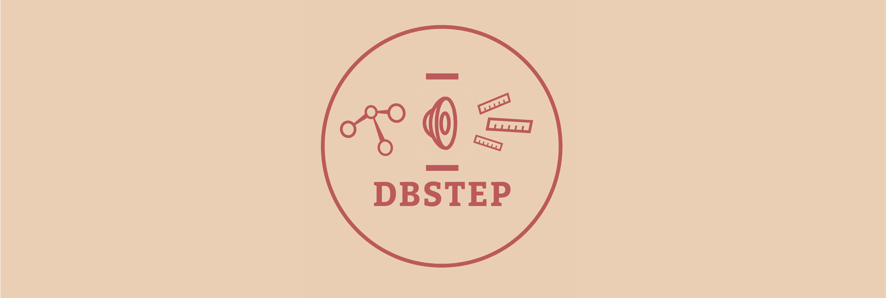
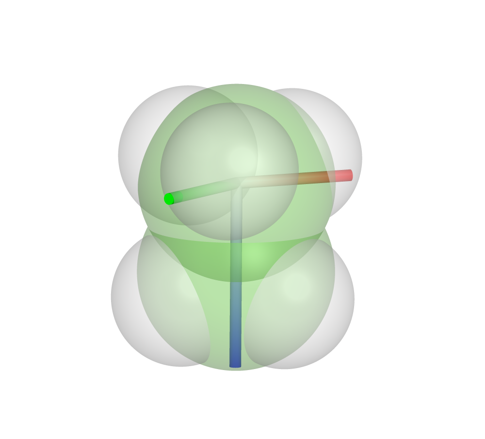
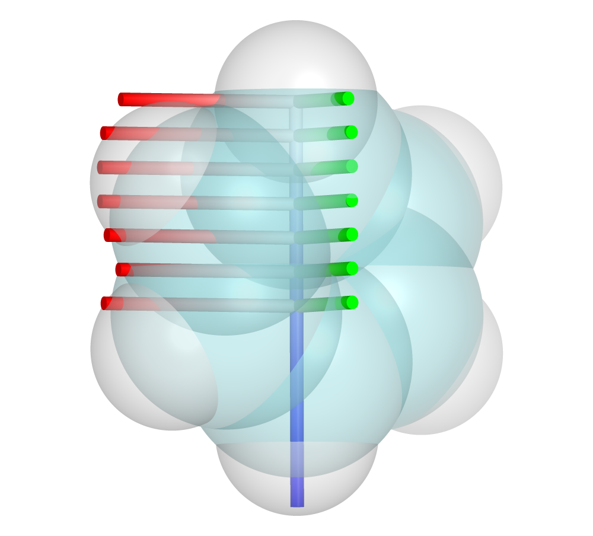
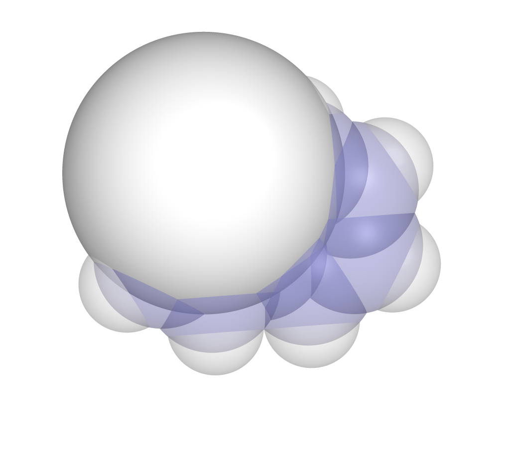

# DBSTEP
DFT-based Steric Parameters

[](https://zenodo.org/badge/latestdoi/198946518) [](https://badge.fury.io/py/dbstep) [](https://anaconda.org/conda-forge/dbstep)
[](https://github.com/patonlab/DBSTEP/actions/workflows/ci.yml)

Allows a user to compute steric parameters from chemical structures.

Calculate Sterimol parameters<sup>1</sup> (L, Bmin, Bmax), %Buried Volume<sup>2</sup>, Sterimol2Vec and Vol2Vec parameters

## Features
* Compute requested steric parameters from molecular structure files with input options:
    * `-s` or `--sterimol` - Sterimol Parameters (L, Bmin, Bmax)
    * `-b` or `--vbur` - Percent Buried Volume
    * `-s` or `--sterimol` AND `--scan [rmin:rmax:interval]` - Sterimol2Vec Parameters
    * `-b` or `--vbur` AND `--scan [rmin:rmax:interval]` - Vol2Vec Parameters
* `-r` - Adjust radius of percent buried volume measurements (default 3.5 Angstrom)
* `--dp [n]` - Number of decimal places in the printed results (default 2)
* `--cutoff [Å or auto]` - Ignore atoms farther than this from atom1. `auto` keeps exactly the atoms that can occupy the buried-volume sphere, so %V_Bur is unchanged while the grid stays small for large systems (clusters, proteins). With a cutoff, the molecular volume column reports only the kept atoms (`MolVol_cut`) and Sterimol L is bounded by the cutoff.
* `--quiet` - Suppress all printed output (results are still available from the Python object)
* Exclude atoms from steric measurement with `--exclude [atom indices]` option (no spaces, separated by commas)
* Sterimol parameters can be computed using the classic (Verloop) definition from van der Waals radii, or using a three-dimensional grid (default is classic).
    * Change measurement type with `--measure ['classic' or 'grid']`. Grid-based measurement is automatically used for scans and density surfaces.
    * Grid point spacing can be adjusted (default spacing is 0.05 Angstrom), adjust with `--grid [# in Angstrom]`
    * `--pos` - Only measure Sterimol parameters in the positive direction (from atom1 toward atom2) in grid mode
    * `--atom3 [idx]` - Align a third atom to the positive x direction to fully define the molecular orientation
    * `--norot` - Skip the alignment step for structures that are already aligned along the z-axis
* Two sets of VDW radii are available:
    * `--radii bondi` (default) - Bondi radii
    * `--radii charry-tkatchenko` - Charry-Tkatchenko free-atom radii derived from dipole polarizability
    * `--scalevdw [factor]` - Scale the chosen radii (default 1.0)
* Steric parameters can be measured from electron density .cube files generated by Gaussian (see [Gaussian cubegen](https://gaussian.com/cubegen/) for information on how to generate these)
    * The `--surface density` command (default vdw) with a .cube input file will measure sterics from density values read in from the file.
    * Density values read from the cube file greater than a default cutoff of 0.0016 determine if a molecule is occupying that point in space, this can be changed with `--isoval [number]`
* Multi-structure `.xyz` and `.sdf` files are processed structure by structure, with each row labelled by the structure's name (comment line / SDF title)
* `-t` or `--tensor` - Return a 3D binary occupancy tensor of the aligned molecule (requires `--atom1`, `--atom2` and `--atom3`); add `--save` to write it to a `.npy` file and `--pymol` to visualize the voxels
* `--noH` - exclude hydrogen atoms from steric measurements
* `--nometals` - exclude metal atoms from steric measurements
* `--sambvca` - SambVca 2.1 mode (Bondi radii scaled by 1.17, H atoms excluded)

### 2-D Graph contribution features (Requires RDKit and Pandas packages to be installed):
* Compute graph-based steric contributions in layers spanning outward from a reference functional group with the following input options:
    * `--2d` - Toggle 2D measurements on
    * `--fg` - Specify an atom or functional group to use as a reference as a SMILES string
    * `--maxpath` - The number of layers to measure. A connectivity matrix is used to compute the shortest path to each atom from the reference functional group.
    * `--2d-type` - The type of steric contributions to use. Options include Crippen molar refractivities or McGowan volume

See [CHANGELOG.md](CHANGELOG.md) for what changed in each release.

## Requirements & Dependencies
* Python 3.10 or greater
* Non-standard dependencies will be installed along with DBSTEP, but include [numpy](https://numpy.org/), [scipy](https://www.scipy.org/), and [cclib](https://cclib.github.io/).

## Install

#### uv (recommended)
```
uv add dbstep
```

#### Conda and PyPI (`pip`)
- Install using conda
    `conda install -c conda-forge dbstep`
- Or using pip
    `pip install dbstep`

After installation, the `dbstep` command is available directly on the command line, or run as a module with `python -m dbstep`.

#### Development install
```
git clone https://github.com/patonlab/DBSTEP.git
cd DBSTEP
uv sync --extra dev
```

## Citing DBSTEP
Please reference the DOI of our Zenodo repository with:
```
Luchini, G.; Patterson, T.; Paton, R. S. DBSTEP: DFT Based Steric Parameters. 2022, DOI: 10.5281/zenodo.4702097
```

## Usage
DBSTEP reads `.xyz` (single or multi-structure), `.sdf`/`.mol` (V2000, single or multi-structure), `.pdb`/`.ent` (Protein Data Bank, single or multi-MODEL) and Gaussian `.com`/`.gjf` input files natively, and Gaussian 16 cube files containing volumetric density information. Quantum chemistry output files are parsed with the [cclib module](https://onlinelibrary.wiley.com/doi/abs/10.1002/jcc.20823); for the list of supported programs see their documentation [here](https://cclib.github.io/). When used from a Python script, DBSTEP can also read coordinates from [RDKit](https://www.rdkit.org/) mol objects that carry a 3D conformer.

### Residues in proteins (PDB input)

With a PDB file you can pick a residue and atoms by name instead of file indices. The measurement is centred on the chosen atom and only the atoms within reach of the buried-volume sphere are kept (`--cutoff auto` is switched on automatically), so a whole protein runs in seconds.

```
>>>dbstep 1a8o.pdb --residue A:186 --vbur --sterimol --nowater

                   File  Atom1  Atom2    R/Å MolVol_cut     %V_Bur     %S_Bur       Bmin       Bmax          L
   -----------------------------------------------------------------------------------------------------------
     1a8o.pdb A:186 THR     CA     CB   3.50     533.54      65.95       0.00       5.54       7.12       7.19
   -----------------------------------------------------------------------------------------------------------
```

* `--residue A:45` selects chain A residue 45 (append an insertion code: `A:45A`; `45` alone works when only one chain has it; several residues separated by commas form one selection)
* `--atom CA` names atom1 within the residue (default CA); `--atom2` and `--atom3` accept atom names too (default atom2: CB, falling back to HA or N for glycine)
* `--nowater` drops water molecules; `--nohet` drops other hetero groups such as ligands and ions (modified residues with a peptide backbone, e.g. MSE, stay); `--chain A` keeps a single chain
* `--exclude-self` lets the residue occupy no volume, so only its environment is measured (a pocket size); `--self-only` keeps only the residue, which equals extracting it to its own file
* Sterimol L measured from CA through the surroundings is a distance to the nearest steric wall along the CA→CB direction, not a substituent length, so do not compare it with Verloop values
* Crystal structures usually lack hydrogens; results differ from a protonated model. `--sambvca` (heavy atoms only, Bondi × 1.17) is a consistent choice for raw PDB files

* `--residue all` runs every polymer residue in turn (waters and ligands are skipped, modified residues such as MSE are included; combine with `--chain`)
* `--csv results.csv` writes one row per file, frame, residue and radius with the columns `file, frame, structure, residue, atom1, atom2, radius, mol_vol, percent_vbur, percent_sbur, bmin, bmax, L`; this works for any input, not only PDB files

### Trajectories

Multi-frame `.xyz`, multi-record `.sdf` and multi-MODEL `.pdb` files are trajectories: every frame is measured in turn (the neighbourhood crop is recomputed per frame, so frames cost the same as single structures). `--frames start:stop:stride` selects frames with Python slice rules on the 0-based index, e.g. `--frames 0:1000:10` or `--frames ::5`, and `--csv` collects the time series:

```
dbstep md_frames.pdb --residue A:45 --vbur --nowater --frames ::10 --csv vbur_A45.csv
```

From Python, `db.all_frames("md_frames.pdb", frames="::10", residue="A:45", volume=True, nowater=True)` returns one object per frame; the `frame` and `structure` columns of `results` identify it. Binary trajectory formats (DCD, XTC, ...) are not read yet; convert to multi-MODEL PDB or multi-frame XYZ first.

From Python: `db.dbstep("1a8o.pdb", residue="A:186", atom="CA", atom2="CB", volume=True, nowater=True, exclude_self=True)`; the object also exposes `atoms`, `coords` and `metadata` for the atoms that were actually measured, and `results`, the list of row dictionaries that `--csv` writes. `db.all_residues("1a8o.pdb", volume=True, nowater=True)` returns one such object per residue.

To execute the program:
- Run from the command line with: `dbstep file --atom1 a1idx --atom2 a2idx` (or `python -m dbstep ...`)

- Run in a Python program by importing: `import dbstep.Dbstep as db` (example below)
```python
import dbstep.Dbstep as db

# Create DBSTEP object
mol = db.dbstep(file, atom1=atom1, atom2=atom2, sterimol=True)

# Grab Sterimol Parameters
L = mol.L
Bmin = mol.Bmin
Bmax = mol.Bmax
```

DBSTEP currently takes a coordinate file (see information on appropriate file types above) along with reference atoms and other input options for steric measurement. Sterimol parameters are measured and output to the user using the `--sterimol` argument, volume parameters can be requested with the `--vbur` option.

Atoms are specified by referring to the index of an atom in a coordinate file, (ex: "2", referencing the second atom in the file, with indexing starting at 1).

For Sterimol parameters, two atoms need to be specified using the arguments `--atom1 [atom1idx]` and `--atom2 [atom2idx]`. The L parameter is measured starting from the specified atom1 coordinates, extending through the atom1-atom2 axis until the end of the molecule is reached. The Bmin and Bmax molecular width parameters are measured on the axis perpendicular to L.

For buried volume parameters, only the `--atom1 [atom]` argument is necessary to specify.

If no atoms are specified, the first two atoms in the file will be used as reference.

### Examples
Examples for obtaining Sterimol, Sterimol2Vec, Percent Buried Volume and Vol2Vec parameter sets are shown below (all example files found in dbstep/data/ directory).

1. Sterimol Parameters for Ethane

    Obtain the Sterimol parameters for an ethane molecule along the C2-C5 bond on the command line:
```
>>>python -m dbstep dbstep/data/Et.xyz --sterimol --atom1 2 --atom2 5

       File  Atom1  Atom2       Bmin       Bmax          L
   -------------------------------------------------------
     Et.xyz      2      5       1.99       2.13       3.24
   -------------------------------------------------------
```

A visualization of these parameters can be shown in PyMOL using the two output files created by DBSTEP, showing the L parameter in blue, Bmin parameter in green and Bmax parameter in red.



2. Sterimol2Vec Parameters for Ph

    The `--scan` argument is formatted as `rmin:rmax:interval` where rmin is the distance from the center along the L axis to start measurements, rmax dictates when to stop measurements, and interval is the frequency of measurements. In this case the length of the molecule (~6A) is measured in 1.0A intervals

```
>>>python -m dbstep dbstep/data/Ph.xyz --sterimol --atom1 1 --atom2 2 --scan 0.0:6.0:1.0

       File  Atom1  Atom2       Bmin       Bmax          L
   -------------------------------------------------------
     Ph.xyz      1      2       1.65       3.16       1.00
     Ph.xyz      1      2       1.65       3.16       2.00
     Ph.xyz      1      2       1.65       3.16       3.00
     Ph.xyz      1      2       1.65       3.16       4.00
     Ph.xyz      1      2       1.65       3.16       5.00
     Ph.xyz      1      2       1.65       3.11       5.95
     Ph.xyz      1      2       1.15       1.17       5.95

   L parameter is  5.95 Ang
   -------------------------------------------------------
```

Displayed in PyMOL, each new Bmin and Bmax axis is added along the L axis.



3. Percent Buried Volume

    %Vb is measured by constructing a sphere (typically with a 3.5A radius) around the center atom and measuring how much of the sphere is occupied by the molecule. Output will include the sphere radius, percent buried volume (%V_Bur) and percent buried shell volume (%S_Bur) (zero in all cases unless a scan is being done simultaneously).
```
>>>python -m dbstep dbstep/data/1Nap.xyz --atom1 2 --vbur

         File   Atom    R/Å    Mol_Vol     %V_Bur     %S_Bur
   ---------------------------------------------------------
     1Nap.xyz      2   3.50     118.65      41.77       0.00
   ---------------------------------------------------------
```

For percent buried volume, the PyMOL script will overlay an appropriate sized sphere where measurement took place.



4. Vol2Vec Parameters

    When invoking the --vbur and --scan parameters simultaneously, vol2vec parameters can be obtained. In this case, a scan is performed using spheres with radii from 2.0A to 4.0A in 0.5A increments.
```
>>>python -m dbstep dbstep/data/CHiPr2.xyz --atom1 1 -b --scan 2.0:4.0:0.5

           File   Atom    R/Å    Mol_Vol     %V_Bur     %S_Bur
   -----------------------------------------------------------
     CHiPr2.xyz      1   2.00     116.50      58.27      49.52
     CHiPr2.xyz      1   2.50     116.50      53.53      46.22
     CHiPr2.xyz      1   3.00     116.50      48.78      38.14
     CHiPr2.xyz      1   3.50     116.50      43.37      29.17
     CHiPr2.xyz      1   4.00     116.50      36.73      16.82
   -----------------------------------------------------------
```

5. 2D Additive sterics

    To calculate 2d graph-based additive sterics, the arguments --2d --fg --maxpath and --2d-type can be used. An input file listing SMILES strings of desired molecule measurements is necessary for calculation. The --fg argument specifies a SMILES string that is common in all provided SMILES inputs to use as a reference point for layer 0. A connectivity matrix will then be used to find atoms 1, 2, 3... N bonds away where N is the max path length specified with the --maxpath argument. One of two types of measurements will be summed at each layer, either Crippen molar refractivities or McGowan volumes, computed for each atom. This can be changed with the --2d-type argument.

```
>>>python -m dbstep dbstep/data/smiles.txt --2d --fg "C(O)=O" --maxpath 5 --2d-type mcgowan
```
where smiles.txt looks like:
```
CC(O)=O
CCC(O)=O
CCCC(O)=O
CCCCC(O)=O
CC(C)C(O)=O
CCC(C)C(O)=O
```
The output will then be written to the file "smiles_2d_output.csv" in the format:

|0_mcgowan|1_mcgowan|2_mcgowan|3_mcgowan|4_mcgowan|Structure|
| ------- | ------- | ------- | ------- | ------- | ------- |
|6.51|19.52|0|0|0|CC(=O)O|
|6.51|14.09|19.52|0|0|CCC(=O)O|
|6.51|14.09|14.09|19.52|0|CCCC(=O)O|
|6.51|14.09|14.09|14.09|19.52|CCCCC(=O)O|
|6.51|8.66|39.04|0|0|CC(C)C(=O)O|
|6.51|8.66|33.61|19.52|0|CCC(C)C(=O)O|

### Acknowledgements

This work is developed by Guilian Luchini, Toby Patterson and Robert Paton and is supported by the [NSF Center for Computer-Assisted Synthesis](https://ccas.nd.edu/), grant number [CHE-1925607](https://www.nsf.gov/awardsearch/showAward?AWD_ID=1925607&HistoricalAwards=false)


