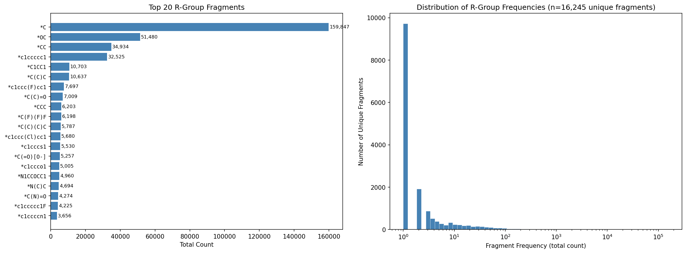

# R-Group Fragmentation via BRICS

This project extracts terminal R-group fragments from a dataset of drug-like molecules using the BRICS (Breaking of Retrosynthetically Interesting Chemical Substructures) algorithm.

## What the Script Does

[brics_fragments_from_csv.py](brics_fragments_from_csv.py) takes a CSV of SMILES strings and:

1. **BRICS Fragmentation** — Applies the 16 retrosynthetic BRICS bond-cutting rules (Degen et al., *ChemMedChem* 2008, 3, 1503–1507) to each molecule, restricted to single bonds only.
2. **Supplemental Methyl Rule** — Catches terminal methyl groups on ring atoms (e.g. N-methyls on caffeine, C-methyls on testosterone) that BRICS misses.
3. **Aromatic N Rule** — Cuts bonds between aromatic ring nitrogens and non-ring substituents (e.g. purines, pyrimidines).
4. **Terminal Fragment Filtering** — Retains only fragments with exactly one attachment point (`*`), discarding linker fragments with 2+ attachment points.

All bonds are cut simultaneously, and fragments are canonicalized with isotope labels stripped.

### Usage

```bash
python brics_fragments_from_csv.py --input molecules.csv --smiles_col smiles --name_col name
```

## Output Files

Given an input file `<stem>.csv`, three output files are produced:

| Output File | Description |
|---|---|
| `<stem>_brics_results.csv` | Per-molecule results with a pipe-delimited list of terminal fragments and fragment count |
| `<stem>_brics_distribution.csv` | Ranked frequency table of all unique fragments with `total_count`, `molecule_count`, and fractions |
| `<stem>_brics_counts.csv` | Wide-format count matrix (molecules × fragments) written in memory-efficient chunks |

## Dataset

The included dataset (`250k_rndm_zinc_drugs_clean_3.csv`) contains ~250,000 drug-like molecules from the ZINC database with columns: `smiles`, `logP`, `qed`, `SAS`.

## Top 20 R-Group Fragments

From the 250K ZINC dataset, **16,245 unique terminal fragments** were identified. The top 20 by total occurrence count:

| Rank | Fragment SMILES | Description | Total Count | Molecule Count | Fraction of Molecules |
|---:|---|---|---:|---:|---:|
| 1 | `*C` | Methyl | 159,847 | 106,357 | 42.6% |
| 2 | `*OC` | Methoxy | 51,480 | 42,649 | 17.1% |
| 3 | `*CC` | Ethyl | 34,934 | 31,369 | 12.6% |
| 4 | `*c1ccccc1` | Phenyl | 32,525 | 30,747 | 12.3% |
| 5 | `*C1CC1` | Cyclopropyl | 10,703 | 10,283 | 4.1% |
| 6 | `*C(C)C` | Isopropyl | 10,637 | 10,314 | 4.1% |
| 7 | `*c1ccc(F)cc1` | 4-Fluorophenyl | 7,697 | 7,610 | 3.1% |
| 8 | `*C(C)=O` | Acetyl | 7,009 | 6,854 | 2.7% |
| 9 | `*CCC` | Propyl | 6,203 | 6,080 | 2.4% |
| 10 | `*C(F)(F)F` | Trifluoromethyl | 6,198 | 6,107 | 2.4% |
| 11 | `*C(C)(C)C` | tert-Butyl | 5,787 | 5,733 | 2.3% |
| 12 | `*c1ccc(Cl)cc1` | 4-Chlorophenyl | 5,680 | 5,640 | 2.3% |
| 13 | `*c1cccs1` | 2-Thienyl | 5,530 | 5,443 | 2.2% |
| 14 | `*C(=O)[O-]` | Carboxylate | 5,257 | 5,179 | 2.1% |
| 15 | `*c1ccco1` | 2-Furyl | 5,005 | 4,936 | 2.0% |
| 16 | `*N1CCOCC1` | Morpholino | 4,960 | 4,922 | 2.0% |
| 17 | `*N(C)C` | Dimethylamino | 4,694 | 4,647 | 1.9% |
| 18 | `*C(N)=O` | Amide (CONH₂) | 4,274 | 4,269 | 1.7% |
| 19 | `*c1ccccc1F` | 2-Fluorophenyl | 4,225 | 4,194 | 1.7% |
| 20 | `*c1ccccn1` | 2-Pyridyl | 3,656 | 3,640 | 1.5% |

## R-Group Frequency Distribution



**Left:** The top 20 fragments by total count. Methyl (`*C`) dominates with ~160K occurrences across 42.6% of molecules. **Right:** The long-tail distribution of all 16,245 unique fragments on a log scale — the vast majority of fragments appear only 1–2 times in the dataset.

## Capped Fragment Libraries

[cap_fragments.py](cap_fragments.py) converts terminal fragments into complete molecules by replacing the dummy atom (`*`) with a capping group. Four capping groups are supported:

- **Phenyl** (`c1ccccc1`) — SMILES rooted so the phenyl ring appears first (e.g. `c1ccc(C)cc1`)
- **tert-Butyl** (`C(C)(C)C`) — SMILES rooted so the t-butyl group appears first (e.g. `CC(C)(C)C`)
- **cis-4-tert-Butylcyclohexyl** — fragment cis to the tert-butyl group on a 1,4-disubstituted cyclohexane
- **trans-4-tert-Butylcyclohexyl** — fragment trans to the tert-butyl group

```bash
python cap_fragments.py --input 250k_rndm_zinc_drugs_clean_3_brics_distribution.csv --min_count 3
```

### Capping Pipeline

1. **Frequency filter** — Retains only fragments appearing ≥ `min_count` times (default: 3), reducing 16,245 unique fragments to 4,592
2. **Dummy replacement** — Replaces the `*` attachment point with the capping group using RDKit `ReplaceSubstructs`
3. **Neutralization** — Converts ionized species to neutral forms using RDKit's `Uncharger` (e.g. `[NH3+]` → `NH2`, `[O-]` → `OH`); leaves internally balanced groups like nitro `[N+](=O)[O-]` untouched
4. **Charge filter** — Drops permanently charged species that cannot be neutralized (quaternary ammonium, pyridinium, diazonium — 17 fragments)
5. **Stereo assignment** (cyclohexyl caps only) — For the 4-tBu-cyclohexyl caps, `EnumerateStereoisomers` generates both cis and trans diastereomers at C1/C4; the correct isomer is selected by comparing `ChiralTag` values (same tag = trans, different = cis)
6. **Stereo filter** — Drops molecules where capping creates an unassigned stereocenter, typically at bridged/fused bicyclic attachment points
7. **Rotatable bond filter** — Drops molecules with ≥ 5 rotatable bonds to keep downstream conformational searches tractable (< 4% of fragments)
8. **Deduplication** — Removes duplicate canonical SMILES arising from fragments that become identical after neutralization (~130–190 per cap group)
9. **Naming** — Assigns sequential IDs (`fragment_00001`, `fragment_00002`, ...) ordered by descending fragment frequency

### Capped Output Files

| Output File | Molecules | Description |
| --- | ---: | --- |
| `<stem>_capped_phenyl.csv` | 4,213 | Phenyl-capped fragments |
| `<stem>_capped_tbutyl.csv` | 4,330 | tert-Butyl-capped fragments |
| `<stem>_capped_cis_tbucy.csv` | 4,151 | cis-4-tert-Butylcyclohexyl-capped fragments |
| `<stem>_capped_trans_tbucy.csv` | 4,151 | trans-4-tert-Butylcyclohexyl-capped fragments |

Each CSV contains: `name`, `smiles`, `attach_atom_idx`, `frag_atom_idx`, `cap_atoms`, `fragment_smiles`, `total_count`, `molecule_count`.

### Validation Checks

All output molecules have been verified to:

- Parse and sanitize successfully in RDKit
- Have zero net formal charge
- Have fully assigned stereocenters
- Successfully embed in 3D (ETKDGv3), with 4–5 strained bridged bicyclics excluded

## Dependencies

- Python 3
- RDKit
- pandas, numpy
- tqdm
- matplotlib (for generating the histogram)

## Reference

Degen, J. et al. "On the Art of Compiling and Using 'Drug-Like' Chemical Fragment Spaces." *ChemMedChem* 2008, 3, 1503–1507. [doi:10.1002/cmdc.200800178](https://doi.org/10.1002/cmdc.200800178)
