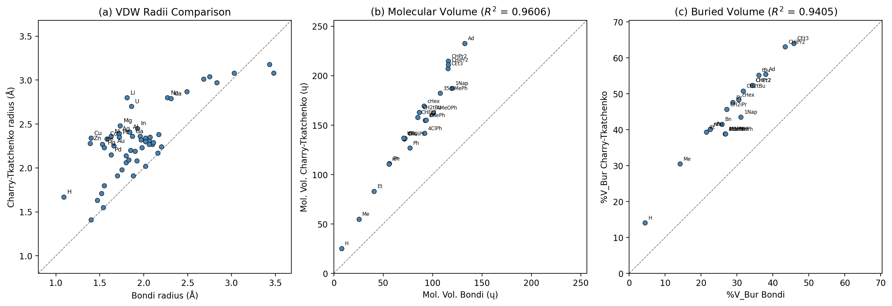
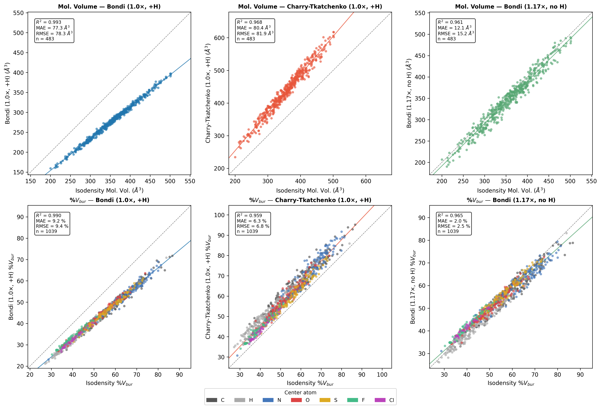
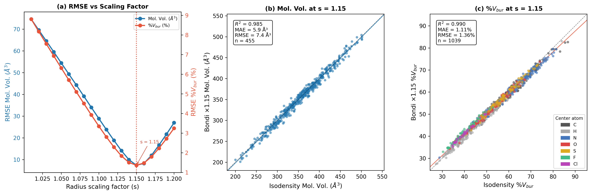
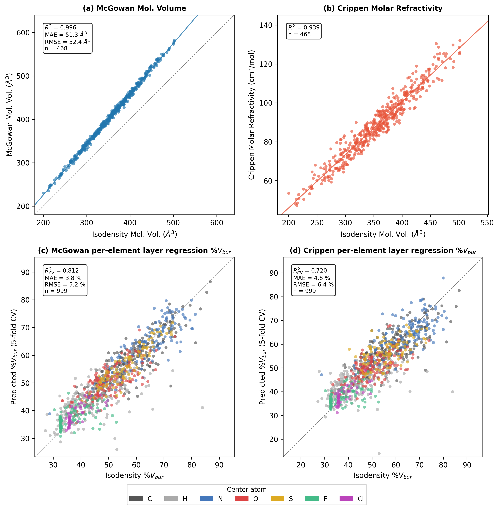
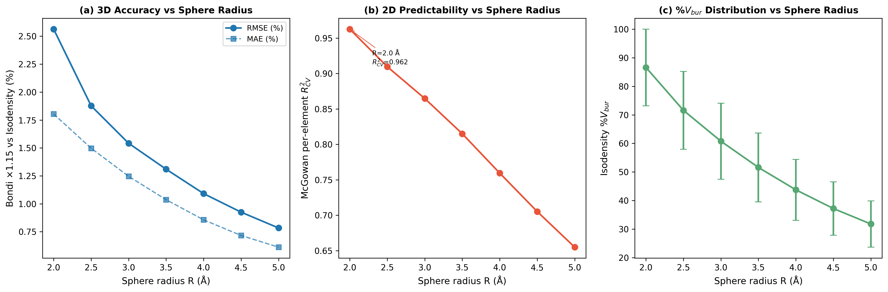

# Radii Benchmarking Pipeline

Comparison of VDW radii sets and scaling strategies for reproducing isodensity molecular volumes and buried volumes.

## Overview

Five benchmarking analyses are provided:

1. **Radii comparison** — qualitative comparison of Bondi vs Charry-Tkatchenko radii
2. **Parity plots (3D)** — quantitative accuracy of three radii conditions vs wB97XD/def2-TZVP isodensity reference (483 molecules, 1039 buried volume samples)
3. **Optimal scaling** — systematic sweep of Bondi scaling factors to minimise deviation from isodensity reference (optimal s = 1.15)
4. **Parity plots (2D)** — comparison of graph-based McGowan volumes and Crippen MR against the isodensity reference
5. **Sphere radius dependence** — how 3D accuracy and 2D predictability vary with buried volume sphere radius (R = 2.0–5.0 Å)

---

## 1. Radii Comparison

**Script:** `compare_radii.py`
**Output:** `radii_comparison.png`

Generates a 3-panel figure comparing the two VDW radii sets available in DBSTEP:

- **(a)** Scatter plot of Bondi vs Charry-Tkatchenko radii for all 54 shared elements. The Charry-Tkatchenko radii (free-atom, derived from dipole polarizability) are systematically larger than Bondi radii for most elements, particularly for transition metals (e.g. Cu, Zn, Pd, Pt).
- **(b)** Molecular volumes computed with both radii sets for all 22 molecules in `dbstep/data/`.
- **(c)** Percent buried volumes (%V_Bur) at R = 3.5 Å for the same molecules.

**References:**
- Bondi: *J. Phys. Chem.* **1964**, *68*, 441; Mantina et al. *J. Phys. Chem. A* **2009**, *113*, 5806
- Charry-Tkatchenko: *J. Chem. Theory Comput.* **2024**, *20*, 7844-7855 (R_vdW^free[alpha] from Table S1, SI)

```bash
uv run python analysis/radii/compare_radii.py
```



---

## 2. Parity Plots vs Isodensity Reference

**Script:** `parity_plots.py`
**Output:** `parity_plots.png`

A 2×3 figure comparing three radii conditions against the isodensity reference (0.0016 e/Bohr³ electron density surface from wB97XD/def2-TZVP calculations):

| Condition | Radii | Scaling | Hydrogens |
|-----------|-------|---------|-----------|
| Bondi | Bondi | 1.0× | included |
| Charry-Tkatchenko | Charry-Tkatchenko | 1.0× | included |
| SambVca | Bondi | 1.17× | excluded |

**Top row — molecular volumes** (483 molecules from ZINC dataset):
- Parity plots of VDW vs isodensity molecular volume for each condition
- Reference: `tz_isodensity_volumes.txt`, `bondi_volumes.txt`, `charry_volumes.txt`, `sambvca_volumes.txt`

**Bottom row — buried volumes** (1039 stratified atom-center samples):
- Parity plots of %V_Bur vs isodensity %V_Bur, coloured by center-atom element
- Reference: `tz_isodensity_sampled.csv`, `bondi_sampled.csv`, `charry_sampled.csv`, `sambvca_sampled.csv`

### Sampling strategy

Buried volume samples were generated using a stratified element-based approach to ensure diverse element coverage:

| Element | Quota | Notes |
|---------|-------|-------|
| C | 250 | |
| H | 250 | |
| N | 150 | |
| O | 150 | |
| S | 100 | |
| F | 94 | capped (only 94 molecules contain F) |
| Cl | 50 | |
| **Total** | **1044** | |

At most one atom of each element is sampled per molecule. See `sample_atoms.py` for details; `sample_atoms.csv` contains the full list of (mol_file, atom1_idx, element) triples.

### Running the calculations

Buried volume calculations for all three conditions are run with:

```bash
uv run python analysis/radii/run_sampled_vbur.py
```

This produces `bondi_sampled.csv`, `charry_sampled.csv`, and `sambvca_sampled.csv`.

The isodensity reference (`tz_isodensity_sampled.csv`) requires cube files generated at the wB97XD/def2-TZVP level of theory and should be run on a server:

```bash
# Copy sample_atoms.csv and run_sampled_vbur.py to server, then:
python analysis/radii/run_sampled_vbur.py --isodensity
```

### Generating the figure

```bash
uv run python analysis/radii/parity_plots.py
```



---

## 3. Optimal Bondi Scaling Factor

**Script:** `optimal_scaling.py`
**Output:** `optimal_scaling.png`

Determines the optimal Bondi radius scaling factor for reproducing isodensity molecular volumes and buried volumes (wB97XD/def2-TZVP reference) by running actual DBSTEP calculations across a sweep of scaling factors.

**Result: s = 1.15 is optimal for both molecular volume (RMSE = 7.4 ų) and %V_Bur (RMSE = 1.36%).**

**Sweep:** s = 1.01 to 1.20 in steps of 0.01 (20 values total)
- s = 1.01–1.20 uses `bondi_x{s:.2f}_sampled.csv`

**Reference data:**
- Molecular volumes: `tz_isodensity_volumes.txt` (483 molecules, mol_id from filename)
- Buried volumes: `tz_isodensity_sampled.csv` (1039 samples)

**Output panels:**
- **(a)** RMSE vs scaling factor for both molecular volume (ų, left y-axis) and %V_Bur (%, right y-axis), with vertical lines marking the optimal s for each metric
- **(b)** Molecular volume parity plot at s = 1.15
- **(c)** %V_Bur parity plot at s = 1.15, coloured by center-atom element

### Running the sweep

First generate the sweep CSV files (skips any that already exist):

```bash
uv run python analysis/radii/run_sampled_vbur.py --sweep
```

Then generate the figure:

```bash
uv run python analysis/radii/optimal_scaling.py
```



---

## 4. 2D Graph-Based Volumes vs Isodensity Reference

**Script:** `2d_parity_plots.py`
**Output:** `2d_parity_plots.png`

A 2×2 figure comparing 2D graph-based volume descriptors (computed from molecular connectivity only, no 3D coordinates) against the isodensity reference. Molecules are read from xyz files and bonds are perceived using RDKit's `rdDetermineBonds` (15/486 molecules fail bond perception and are excluded).

### Top row — molecular volumes (468 molecules)

- **(a)** McGowan volume (R² = 0.996, MAE = 51.3 ų, RMSE = 52.4 ų) — excellent linear correlation; McGowan volumes (converted to ų) systematically underestimate isodensity volumes
- **(b)** Crippen molar refractivity (R² = 0.939) — strong correlation despite measuring a different physical quantity (polarizability vs volume)

### Bottom row — buried volume via per-element layer regression (999 samples, 5-fold CV)

Per-atom contributions are binned by graph distance (0–6 bonds) from the center atom, then used as features in a linear regression to predict isodensity %V_Bur. A **separate model is trained for each center-atom element**, and predictions are from 5-fold cross-validation within each element group.

- **(c)** McGowan per-element layer regression (R²_CV = 0.812, MAE = 3.8%)
- **(d)** Crippen per-element layer regression (R²_CV = 0.720, MAE = 4.8%)

### Per-element performance (5-fold CV)

| Element | n | McGowan R²_CV | McGowan MAE | Crippen R²_CV | Crippen MAE |
| ------- | ---: | :-----------: | :---------: | :-----------: | :---------: |
| C | 242 | 0.763 | 3.6% | 0.613 | 4.9% |
| H | 235 | 0.465 | 4.9% | 0.275 | 5.8% |
| N | 144 | 0.751 | 3.9% | 0.582 | 5.0% |
| O | 140 | 0.538 | 4.1% | 0.443 | 4.4% |
| S | 98 | 0.834 | 2.5% | 0.359 | 4.8% |
| F | 92 | 0.235 | 3.6% | 0.199 | 3.8% |
| Cl | 48 | 0.549 | 2.1% | 0.477 | 2.2% |
| **Overall** | **999** | **0.812** | **3.8%** | **0.720** | **4.8%** |

### Global model layer regression coefficients

For reference, a single global model (all elements pooled) gives R²_CV = 0.776 (McGowan) / 0.670 (Crippen). The learned layer weights are:

| Layer (bonds from center) | McGowan weight | Crippen weight |
| :-----------------------: | :------------: | :------------: |
| 0 | −0.1057 | −0.1447 |
| 1 | +0.1921 | +1.5648 |
| 2 | +0.3203 | +1.1590 |
| 3 | +0.2433 | +0.7406 |
| 4 | +0.1354 | +0.2266 |
| 5 | +0.1000 | +0.3938 |
| 6 | +0.0051 | −0.0413 |
| Intercept | 14.99 | 20.59 |

Layers 1–3 carry the largest positive weights, consistent with the R = 3.5 Å buried volume sphere capturing atoms within ~3 bonds.

**Conclusion:** 2D graph-based methods reproduce molecular volumes very well (R² = 0.996 for McGowan). For buried volume, per-element layer regression on McGowan contributions achieves R²_CV = 0.81, a reasonable approximation from connectivity alone, though 3D methods (R² > 0.99 at optimal scaling) remain substantially more accurate.

```bash
uv run python analysis/radii/2d_parity_plots.py
```



---

## 5. Sphere Radius Dependence

**Script:** `radius_dependence.py`
**Output:** `radius_dependence.png`

Analyses how buried volume accuracy (3D) and predictability (2D) vary with the sphere radius R used in %V_Bur calculations. All previous analyses use the default R = 3.5 Å; this section tests R = 2.0, 2.5, 3.0, 3.5, 4.0, 4.5, 5.0 Å.

**Panels:**
- **(a)** 3D accuracy: RMSE/MAE of Bondi ×1.15 vs isodensity %V_Bur at each R
- **(b)** 2D predictability: McGowan per-element layer regression R²_CV at each R
- **(c)** %V_Bur distribution: mean ± std of isodensity %V_Bur at each R

### Results

| R (Å) | Mean %V_Bur | Std %V_Bur | 3D RMSE (%) | 3D MAE (%) | 3D R² | 2D R²_CV | 2D MAE (%) |
|:------:|:-----------:|:----------:|:-----------:|:----------:|:-----:|:--------:|:----------:|
| 2.0 | 86.6 | 13.4 | 2.56 | 1.80 | 0.963 | 0.962 | 1.5 |
| 2.5 | 71.6 | 13.6 | 1.88 | 1.50 | 0.981 | 0.910 | 3.0 |
| 3.0 | 60.8 | 13.3 | 1.54 | 1.25 | 0.987 | 0.865 | 3.6 |
| 3.5 | 51.6 | 12.1 | 1.31 | 1.04 | 0.988 | 0.815 | 3.8 |
| 4.0 | 43.7 | 10.7 | 1.09 | 0.86 | 0.990 | 0.759 | 3.9 |
| 4.5 | 37.2 | 9.3 | 0.93 | 0.72 | 0.990 | 0.705 | 3.7 |
| 5.0 | 31.8 | 8.1 | 0.78 | 0.61 | 0.991 | 0.655 | 3.5 |

**Key findings:**
- **3D accuracy improves with larger R**: RMSE drops from 2.6% (R=2.0) to 0.8% (R=5.0) — larger spheres average out local radii differences between VDW and isodensity surfaces
- **2D predictability improves with smaller R**: R²_CV rises from 0.66 (R=5.0) to 0.96 (R=2.0) — graph-distance features capture the local environment best at short range
- **The default R = 3.5 Å is a reasonable compromise** between 3D accuracy (R² = 0.99, RMSE = 1.3%) and 2D predictability (R²_CV = 0.82)

### Running the radius sweep

Generate VDW data locally and isodensity data on the server:

```bash
# Local: Bondi x1.15 at each sphere radius
uv run python analysis/radii/run_sampled_vbur.py --radius-sweep

# Server: isodensity reference at each sphere radius
python analysis/radii/run_sampled_vbur.py --radius-sweep --isodensity
```

Then generate the figure:

```bash
uv run python analysis/radii/radius_dependence.py
```



---

## Full Pipeline

To reproduce all results from scratch (excluding the isodensity reference which requires cube files):

```bash
# 1. Generate atom sample list
uv run python analysis/radii/sample_atoms.py

# 2. Run VDW calculations (Bondi, Charry-Tkatchenko, SambVca)
uv run python analysis/radii/run_sampled_vbur.py

# 3. Run scaling sweep (Bondi x1.01 to x1.20)
uv run python analysis/radii/run_sampled_vbur.py --sweep

# 4. Run radius sweep (Bondi x1.15 at R = 2.0–5.0 Å)
uv run python analysis/radii/run_sampled_vbur.py --radius-sweep

# 5. Generate figures
uv run python analysis/radii/compare_radii.py
uv run python analysis/radii/parity_plots.py
uv run python analysis/radii/optimal_scaling.py
uv run python analysis/radii/2d_parity_plots.py
uv run python analysis/radii/radius_dependence.py
```

Steps 2–5 require `tz_isodensity_sampled.csv` and `tz_isodensity_volumes.txt` from the wB97XD/def2-TZVP isodensity reference calculations. Step 5 additionally requires `tz_isodensity_r{R}_sampled.csv` files from the server (run with `--radius-sweep --isodensity`).
