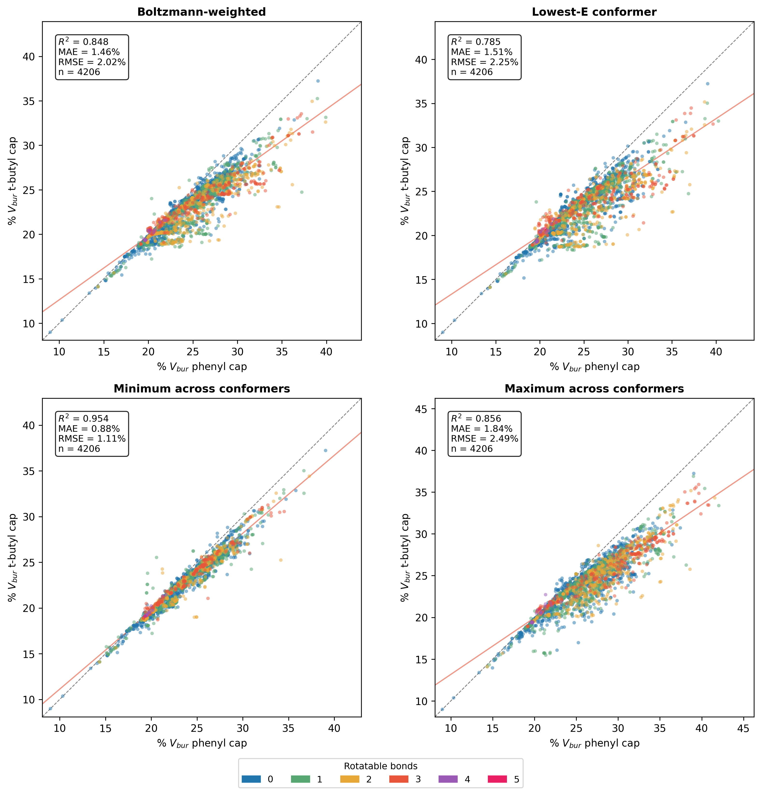

# Cap Group Comparison: Buried Volume of Capped BRICS Fragments

This analysis compares percent buried volume (%V_bur) computed with two different capping groups — **phenyl** and **t-butyl** — on BRICS fragments derived from the ZINC drug-like molecule dataset.

## Motivation

When computing buried volume for molecular fragments, a capping group must replace the dummy atom at the attachment point. The choice of cap could influence the measured steric parameter. This analysis quantifies that influence across >4000 fragments to assess whether phenyl and t-butyl caps give consistent %V_bur values.

## Pipeline

### 1. Fragment generation

BRICS decomposition of 250k ZINC drug-like molecules produces a distribution of terminal fragments (`analysis/r_group_fragmentation/`). Fragments appearing >= 3 times are retained (4592 unique fragments).

### 2. Capping (`cap_fragments.py`)

Each fragment's dummy atom (`*`) is replaced with a capping group using RDKit's `ReplaceSubstructs`. Cap group atoms are identified via **atom-property tagging**: fragment heavy atoms are tagged with `_is_frag` before replacement, so untagged atoms in the product are unambiguously the cap — even when the fragment contains the same substructure as the cap (e.g. a phenyl fragment capped with phenyl).

After capping, molecules are filtered to remove:
- Permanently charged species
- Fragments with unassigned stereocenters
- Fragments with >= 5 rotatable bonds

This yields **4213 phenyl-capped** and **4330 t-butyl-capped** unique molecules.

Output: `zinc_fragments_{phenyl,t_butyl}_capped.csv` containing SMILES, attachment atom index, fragment atom index, and cap atom indices.

### 3. Conformer generation (Auto3D + AIMNet2)

3D structures are generated with Auto3D and optimized with AIMNet2, producing multiple conformers per fragment ranked by energy.

Output: `zinc_fragments_{phenyl,t_butyl}_capped.sdf`

### 4. Buried volume computation (`compute_buried_vol.py`)

For each conformer, DBSTEP computes %V_bur at the cap attachment atom within a 3.5 A sphere, excluding cap group atoms (heavy atoms + their hydrogens) from the steric measurement. The CSV atom indices are used directly since Auto3D preserves the canonical SMILES atom ordering in the SDF.

Per-fragment summary statistics are computed via Boltzmann weighting over conformers.

Output: `zinc_fragments_{phenyl,t_butyl}_capped_buried_vol.csv` (per-conformer) and `*_buried_vol_summary.csv` (per-fragment Boltzmann-weighted, min-E, min, max).

### 5. Parity plots (`plot_cap_comparison.py`)

Fragments are matched between phenyl and t-butyl datasets by their original `fragment_smiles`. Points are colored by number of rotatable bonds in the fragment.

## Results

4206 fragments are common to both cap groups. The parity plots compare four %V_bur metrics:

| Metric | R² | MAE | RMSE |
|---|---|---|---|
| Boltzmann-weighted | 0.848 | 1.46% | 2.02% |
| Lowest-E conformer | 0.785 | 1.51% | 2.25% |
| Minimum across conformers | **0.954** | 0.88% | 1.11% |
| Maximum across conformers | 0.856 | 1.84% | 2.49% |

The **minimum-conformer** metric shows the tightest correlation (R² = 0.954, MAE = 0.88%), indicating that the most compact conformer is least sensitive to cap group choice. Scatter increases with rotatable bond count, as expected from greater conformational flexibility.

## Files

| File | Description |
|---|---|
| `compute_buried_vol.py` | Compute %V_bur from SDF + capped CSV |
| `plot_cap_comparison.py` | Generate 2x2 parity plots |
| `zinc_fragments_phenyl_capped.csv` | Phenyl-capped fragment definitions |
| `zinc_fragments_t_butyl_capped.csv` | T-butyl-capped fragment definitions |
| `zinc_fragments_*_capped.sdf` | 3D conformers (Auto3D + AIMNet2) |
| `zinc_fragments_*_buried_vol.csv` | Per-conformer %V_bur results |
| `zinc_fragments_*_buried_vol_summary.csv` | Per-fragment Boltzmann-weighted summaries |
| `cap_comparison.{png,pdf}` | Parity plot figures |
| `outlier_*.sdf` | Extracted conformers for outlier fragments |
